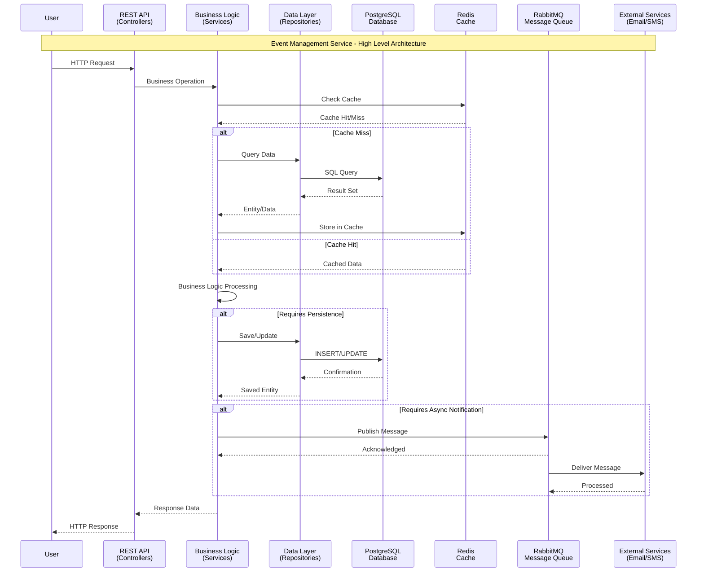
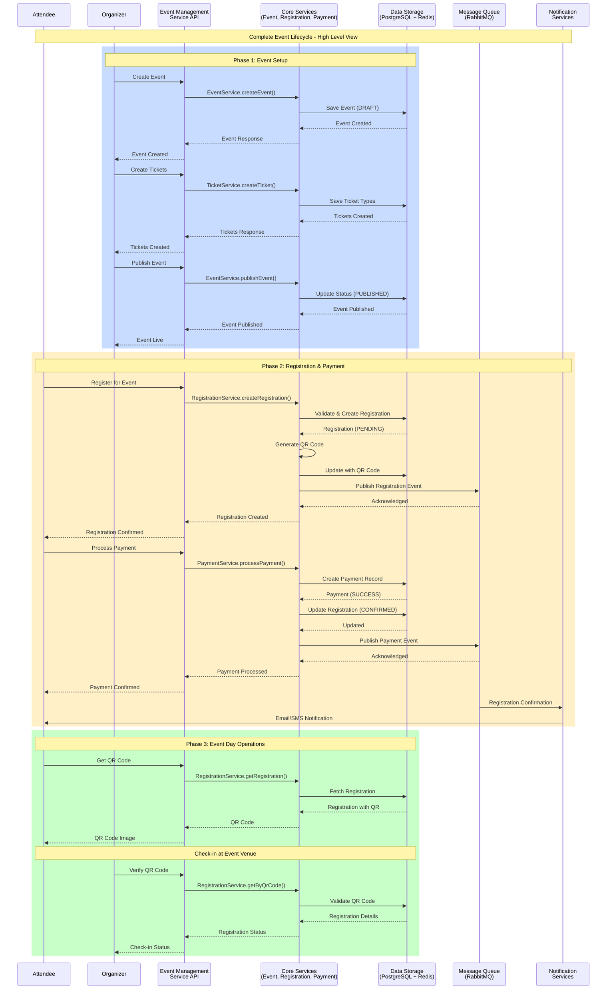
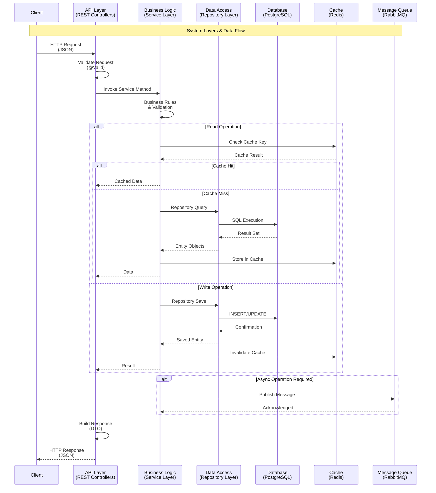
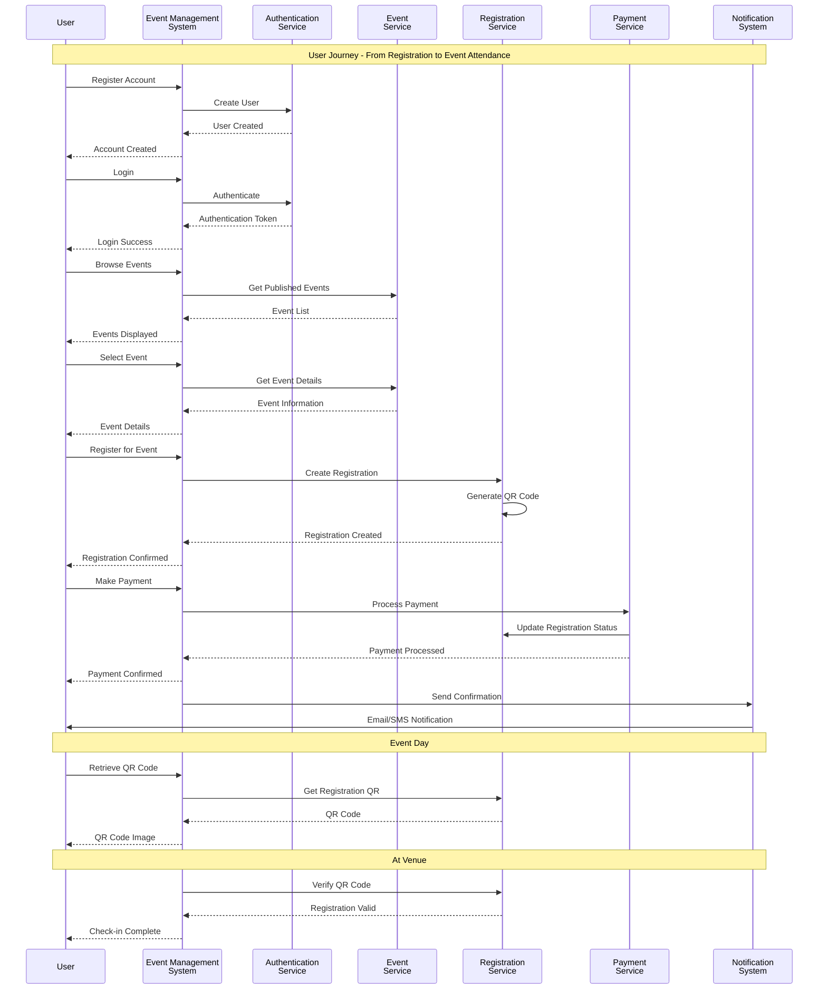
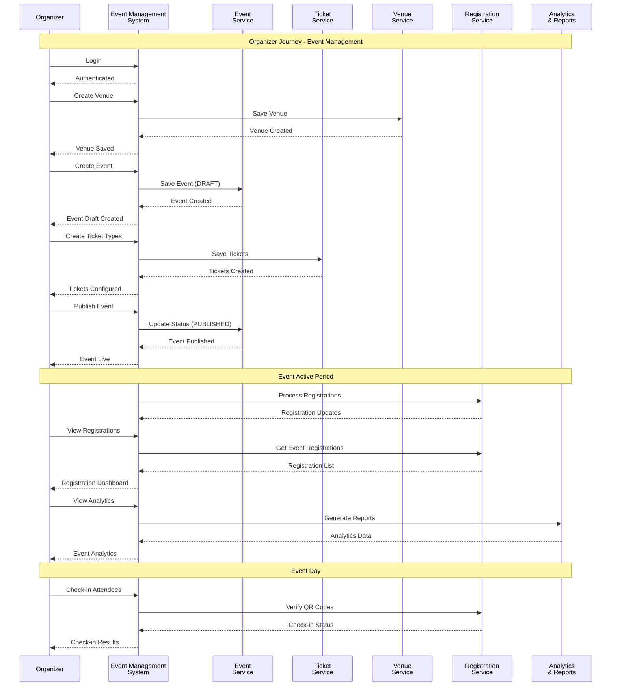
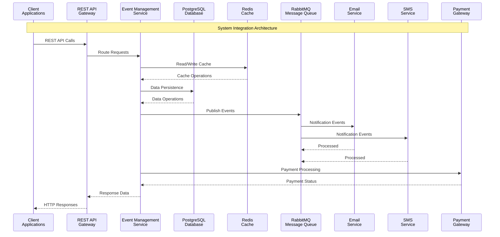

# Event Management Service - High-Level Sequence Diagrams

This document provides high-level sequence diagrams showing the overall system architecture and major business flows at a macro level.

---

## 1. System Architecture Overview

---

## 2. Complete Event Lifecycle - High Level

---

## 3. System Layers & Data Flow

---

## 4. User Journey - High Level

---

## 5. Organizer Journey - High Level

---

## 6. System Integration Overview

---

## Key Components

### API Layer (Controllers)
- **AuthController**: User authentication and registration
- **EventController**: Event CRUD operations
- **TicketController**: Ticket management
- **RegistrationController**: Event registration
- **PaymentController**: Payment processing
- **VenueController**: Venue management
- **CategoryController**: Category management
- **UserController**: User management

### Business Logic Layer (Services)
- **AuthService**: Authentication and authorization
- **EventService**: Event business logic
- **TicketService**: Ticket management logic
- **RegistrationService**: Registration processing
- **PaymentService**: Payment processing
- **QRCodeService**: QR code generation
- **NotificationService**: Async notifications
- **VenueService**: Venue management
- **CategoryService**: Category management
- **UserService**: User management

### Data Layer
- **Repositories**: JPA repositories for data access
- **Entities**: Domain model entities
- **PostgreSQL**: Primary relational database
- **Redis**: Caching layer for performance

### External Integrations
- **RabbitMQ**: Message queue for async processing
- **Email Service**: Email notifications (via MQ)
- **SMS Service**: SMS notifications (via MQ)
- **Payment Gateway**: Payment processing (future integration)

---

## Notes

- **High-level diagrams** show major system interactions and flows
- **Detailed diagrams** are available in `SEQUENCE_DIAGRAMS.md`
- All diagrams use **Mermaid** syntax
- Diagrams can be rendered in GitHub, GitLab, VS Code, and documentation tools

