# Event Management Service - Sequence Diagrams

This document contains sequence diagrams for all major flows in the Event Management Service.

---

## High-Level System Overview

### System Architecture Flow

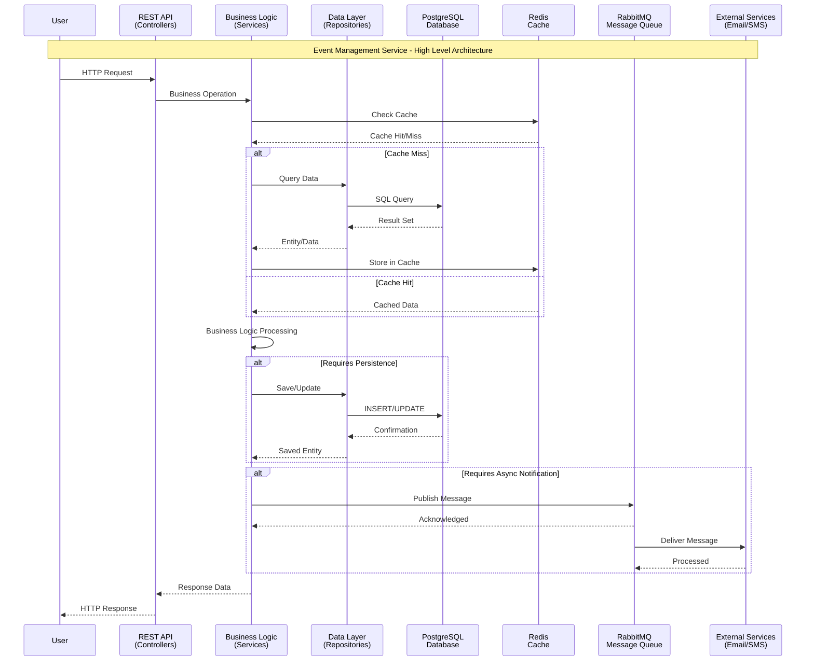
```mermaid
sequenceDiagram
    participant User
    participant API as REST API<br/>(Controllers)
    participant Service as Business Logic<br/>(Services)
    participant Data as Data Layer<br/>(Repositories)
    participant DB as PostgreSQL<br/>Database
    participant Cache as Redis<br/>Cache
    participant MQ as RabbitMQ<br/>Message Queue
    participant External as External Services<br/>(Email/SMS)

    Note over User,External: Event Management Service - High Level Architecture

    User->>API: HTTP Request
    API->>Service: Business Operation
    
    Service->>Cache: Check Cache
    Cache-->>Service: Cache Hit/Miss
    
    alt Cache Miss
        Service->>Data: Query Data
        Data->>DB: SQL Query
        DB-->>Data: Result Set
        Data-->>Service: Entity/Data
        Service->>Cache: Store in Cache
    else Cache Hit
        Cache-->>Service: Cached Data
    end
    
    Service->>Service: Business Logic Processing
    
    alt Requires Persistence
        Service->>Data: Save/Update
        Data->>DB: INSERT/UPDATE
        DB-->>Data: Confirmation
        Data-->>Service: Saved Entity
    end
    
    alt Requires Async Notification
        Service->>MQ: Publish Message
        MQ-->>Service: Acknowledged
        MQ->>External: Deliver Message
        External-->>MQ: Processed
    end
    
    Service-->>API: Response Data
    API-->>User: HTTP Response
```

---

### High-Level Business Process Flow

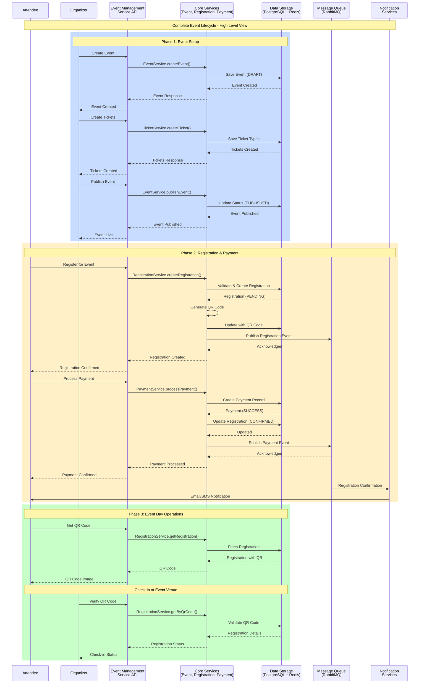
```mermaid
sequenceDiagram
    participant Attendee
    participant Organizer
    participant API as Event Management<br/>Service API
    participant Core as Core Services<br/>(Event, Registration, Payment)
    participant Storage as Data Storage<br/>(PostgreSQL + Redis)
    participant Queue as Message Queue<br/>(RabbitMQ)
    participant Notify as Notification<br/>Services

    Note over Attendee,Notify: Complete Event Lifecycle - High Level View

    rect rgb(200, 220, 255)
        Note over Organizer,Storage: Phase 1: Event Setup
        Organizer->>API: Create Event
        API->>Core: EventService.createEvent()
        Core->>Storage: Save Event (DRAFT)
        Storage-->>Core: Event Created
        Core-->>API: Event Response
        API-->>Organizer: Event Created
        
        Organizer->>API: Create Tickets
        API->>Core: TicketService.createTicket()
        Core->>Storage: Save Ticket Types
        Storage-->>Core: Tickets Created
        Core-->>API: Tickets Response
        API-->>Organizer: Tickets Created
        
        Organizer->>API: Publish Event
        API->>Core: EventService.publishEvent()
        Core->>Storage: Update Status (PUBLISHED)
        Storage-->>Core: Event Published
        Core-->>API: Event Published
        API-->>Organizer: Event Live
    end

    rect rgb(255, 240, 200)
        Note over Attendee,Notify: Phase 2: Registration & Payment
        Attendee->>API: Register for Event
        API->>Core: RegistrationService.createRegistration()
        Core->>Storage: Validate & Create Registration
        Storage-->>Core: Registration (PENDING)
        Core->>Core: Generate QR Code
        Core->>Storage: Update with QR Code
        Core->>Queue: Publish Registration Event
        Queue-->>Core: Acknowledged
        Core-->>API: Registration Created
        API-->>Attendee: Registration Confirmed
        
        Attendee->>API: Process Payment
        API->>Core: PaymentService.processPayment()
        Core->>Storage: Create Payment Record
        Storage-->>Core: Payment (SUCCESS)
        Core->>Storage: Update Registration (CONFIRMED)
        Storage-->>Core: Updated
        Core->>Queue: Publish Payment Event
        Queue-->>Core: Acknowledged
        Core-->>API: Payment Processed
        API-->>Attendee: Payment Confirmed
        
        Queue->>Notify: Registration Confirmation
        Notify->>Attendee: Email/SMS Notification
    end

    rect rgb(200, 255, 200)
        Note over Attendee,Storage: Phase 3: Event Day Operations
        Attendee->>API: Get QR Code
        API->>Core: RegistrationService.getRegistration()
        Core->>Storage: Fetch Registration
        Storage-->>Core: Registration with QR
        Core-->>API: QR Code
        API-->>Attendee: QR Code Image
        
        Note over Attendee,Storage: Check-in at Event Venue
        Organizer->>API: Verify QR Code
        API->>Core: RegistrationService.getByQrCode()
        Core->>Storage: Validate QR Code
        Storage-->>Core: Registration Details
        Core-->>API: Registration Status
        API-->>Organizer: Check-in Status
    end
```

---

### High-Level Component Interaction

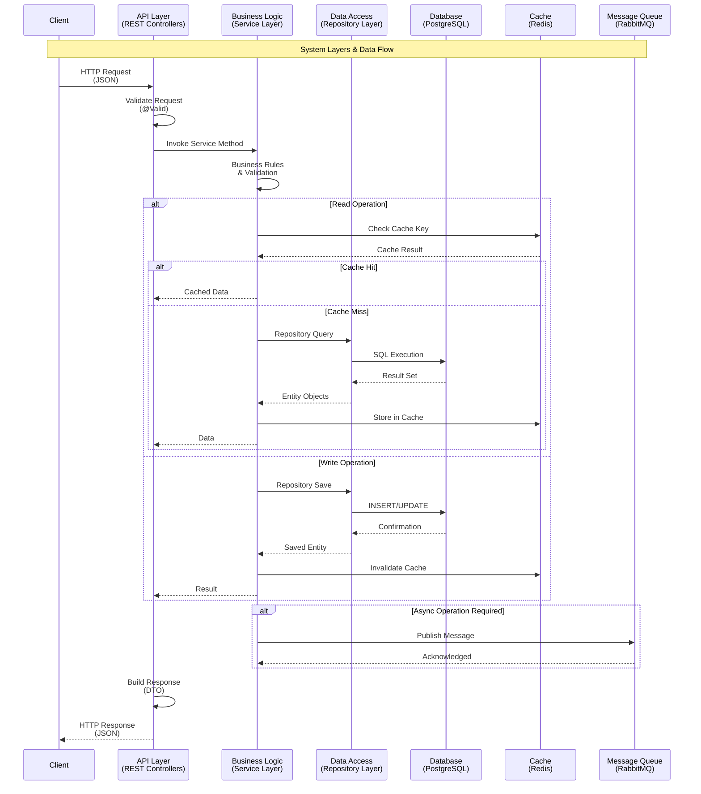
```mermaid
sequenceDiagram
    participant Client
    participant API as API Layer<br/>(REST Controllers)
    participant BL as Business Logic<br/>(Service Layer)
    participant DA as Data Access<br/>(Repository Layer)
    participant DB as Database<br/>(PostgreSQL)
    participant Cache as Cache<br/>(Redis)
    participant MQ as Message Queue<br/>(RabbitMQ)

    Note over Client,MQ: System Layers & Data Flow

    Client->>API: HTTP Request<br/>(JSON)
    
    API->>API: Validate Request<br/>(@Valid)
    API->>BL: Invoke Service Method
    
    BL->>BL: Business Rules<br/>& Validation
    
    alt Read Operation
        BL->>Cache: Check Cache Key
        Cache-->>BL: Cache Result
        
        alt Cache Hit
            BL-->>API: Cached Data
        else Cache Miss
            BL->>DA: Repository Query
            DA->>DB: SQL Execution
            DB-->>DA: Result Set
            DA-->>BL: Entity Objects
            BL->>Cache: Store in Cache
            BL-->>API: Data
        end
    else Write Operation
        BL->>DA: Repository Save
        DA->>DB: INSERT/UPDATE
        DB-->>DA: Confirmation
        DA-->>BL: Saved Entity
        BL->>Cache: Invalidate Cache
        BL-->>API: Result
    end
    
    alt Async Operation Required
        BL->>MQ: Publish Message
        MQ-->>BL: Acknowledged
    end
    
    API->>API: Build Response<br/>(DTO)
    API-->>Client: HTTP Response<br/>(JSON)
```

---

## Detailed Sequence Diagrams

---

## 1. User Registration Flow

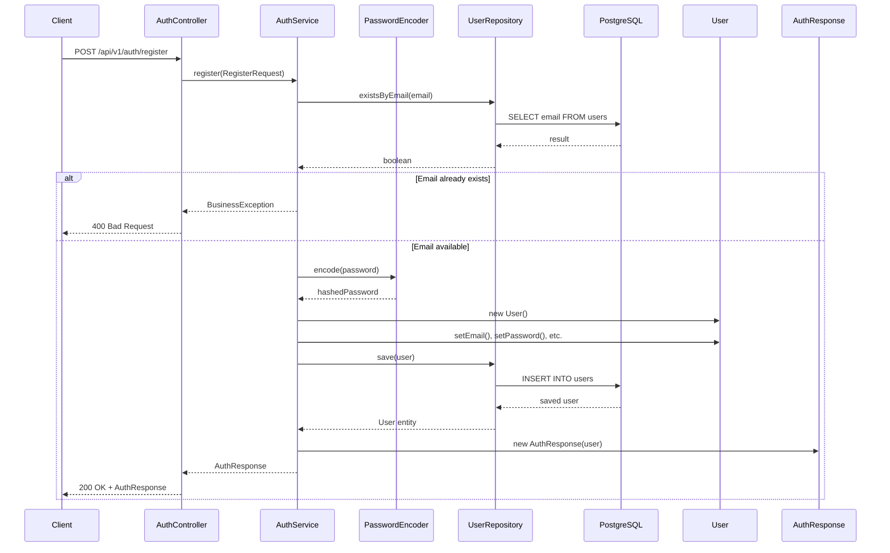
```mermaid
sequenceDiagram
    participant Client
    participant AuthController
    participant AuthService
    participant PasswordEncoder
    participant UserRepository
    participant PostgreSQL

    Client->>AuthController: POST /api/v1/auth/register
    AuthController->>AuthService: register(RegisterRequest)
    
    AuthService->>UserRepository: existsByEmail(email)
    UserRepository->>PostgreSQL: SELECT email FROM users
    PostgreSQL-->>UserRepository: result
    UserRepository-->>AuthService: boolean
    
    alt Email already exists
        AuthService-->>AuthController: BusinessException
        AuthController-->>Client: 400 Bad Request
    else Email available
        AuthService->>PasswordEncoder: encode(password)
        PasswordEncoder-->>AuthService: hashedPassword
        
        AuthService->>User: new User()
        AuthService->>User: setEmail(), setPassword(), etc.
        
        AuthService->>UserRepository: save(user)
        UserRepository->>PostgreSQL: INSERT INTO users
        PostgreSQL-->>UserRepository: saved user
        UserRepository-->>AuthService: User entity
        
        AuthService->>AuthResponse: new AuthResponse(user)
        AuthService-->>AuthController: AuthResponse
        AuthController-->>Client: 200 OK + AuthResponse
    end
```

---

## 2. User Login Flow

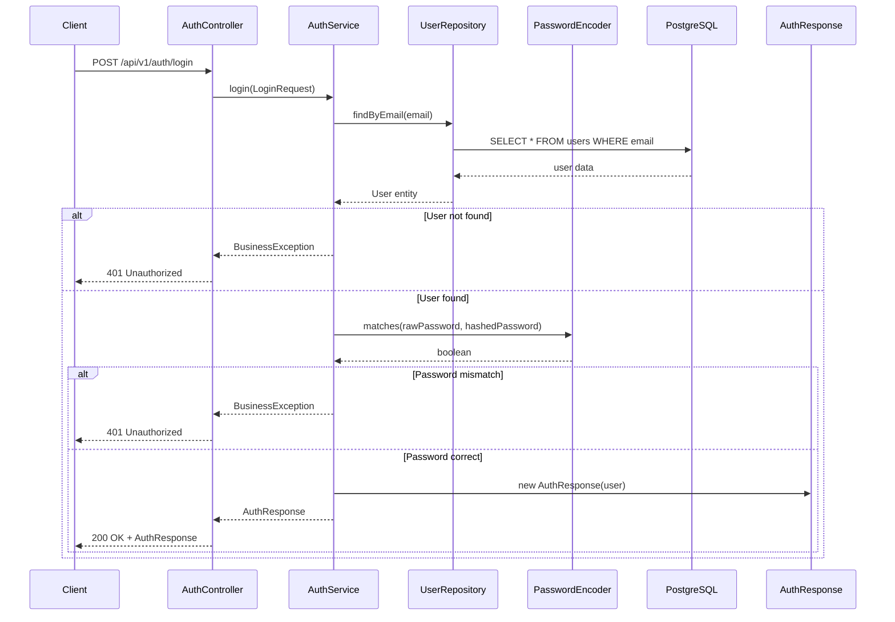
```mermaid
sequenceDiagram
    participant Client
    participant AuthController
    participant AuthService
    participant UserRepository
    participant PasswordEncoder
    participant PostgreSQL

    Client->>AuthController: POST /api/v1/auth/login
    AuthController->>AuthService: login(LoginRequest)
    
    AuthService->>UserRepository: findByEmail(email)
    UserRepository->>PostgreSQL: SELECT * FROM users WHERE email
    PostgreSQL-->>UserRepository: user data
    UserRepository-->>AuthService: User entity
    
    alt User not found
        AuthService-->>AuthController: BusinessException
        AuthController-->>Client: 401 Unauthorized
    else User found
        AuthService->>PasswordEncoder: matches(rawPassword, hashedPassword)
        PasswordEncoder-->>AuthService: boolean
        
        alt Password mismatch
            AuthService-->>AuthController: BusinessException
            AuthController-->>Client: 401 Unauthorized
        else Password correct
            AuthService->>AuthResponse: new AuthResponse(user)
            AuthService-->>AuthController: AuthResponse
            AuthController-->>Client: 200 OK + AuthResponse
        end
    end
```

---

## 3. Event Creation Flow

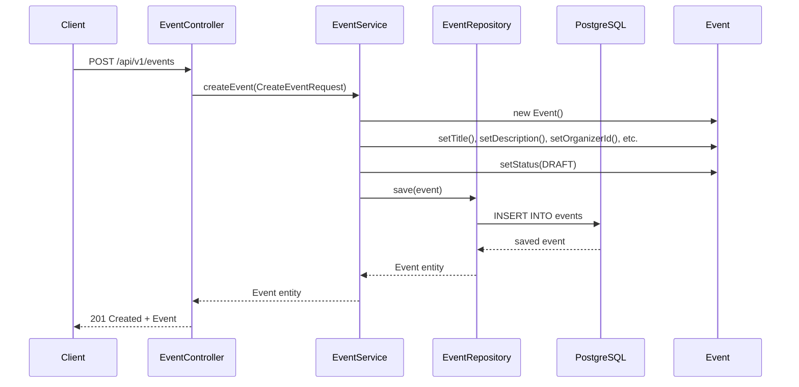
```mermaid
sequenceDiagram
    participant Client
    participant EventController
    participant EventService
    participant EventRepository
    participant PostgreSQL

    Client->>EventController: POST /api/v1/events
    EventController->>EventService: createEvent(CreateEventRequest)
    
    EventService->>Event: new Event()
    EventService->>Event: setTitle(), setDescription(), setOrganizerId(), etc.
    EventService->>Event: setStatus(DRAFT)
    
    EventService->>EventRepository: save(event)
    EventRepository->>PostgreSQL: INSERT INTO events
    PostgreSQL-->>EventRepository: saved event
    EventRepository-->>EventService: Event entity
    
    EventService-->>EventController: Event entity
    EventController-->>Client: 201 Created + Event
```

---

## 4. Event Publishing Flow

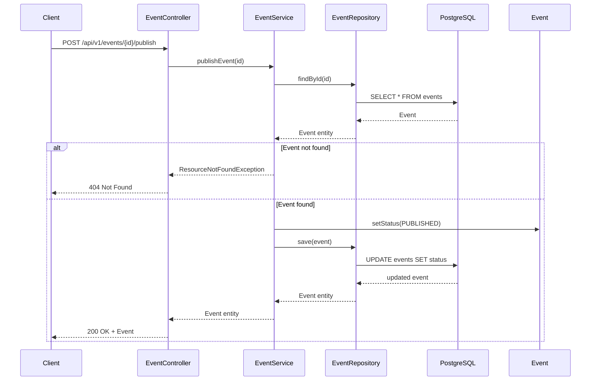
```mermaid
sequenceDiagram
    participant Client
    participant EventController
    participant EventService
    participant EventRepository
    participant PostgreSQL

    Client->>EventController: POST /api/v1/events/{id}/publish
    EventController->>EventService: publishEvent(id)
    
    EventService->>EventRepository: findById(id)
    EventRepository->>PostgreSQL: SELECT * FROM events
    PostgreSQL-->>EventRepository: Event
    EventRepository-->>EventService: Event entity
    
    alt Event not found
        EventService-->>EventController: ResourceNotFoundException
        EventController-->>Client: 404 Not Found
    else Event found
        EventService->>Event: setStatus(PUBLISHED)
        EventService->>EventRepository: save(event)
        EventRepository->>PostgreSQL: UPDATE events SET status
        PostgreSQL-->>EventRepository: updated event
        EventRepository-->>EventService: Event entity
        
        EventService-->>EventController: Event entity
        EventController-->>Client: 200 OK + Event
    end
```

---

## 5. Event Registration Flow (Complete)

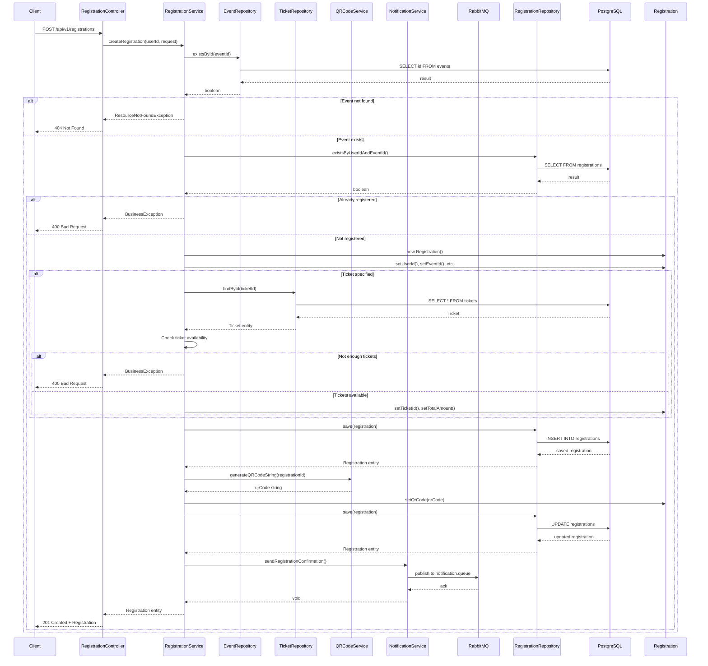
```mermaid
sequenceDiagram
    participant Client
    participant RegistrationController
    participant RegistrationService
    participant EventRepository
    participant TicketRepository
    participant QRCodeService
    participant NotificationService
    participant RabbitMQ
    participant RegistrationRepository
    participant PostgreSQL

    Client->>RegistrationController: POST /api/v1/registrations
    RegistrationController->>RegistrationService: createRegistration(userId, request)
    
    RegistrationService->>EventRepository: existsById(eventId)
    EventRepository->>PostgreSQL: SELECT id FROM events
    PostgreSQL-->>EventRepository: result
    EventRepository-->>RegistrationService: boolean
    
    alt Event not found
        RegistrationService-->>RegistrationController: ResourceNotFoundException
        RegistrationController-->>Client: 404 Not Found
    else Event exists
        RegistrationService->>RegistrationRepository: existsByUserIdAndEventId()
        RegistrationRepository->>PostgreSQL: SELECT FROM registrations
        PostgreSQL-->>RegistrationRepository: result
        RegistrationRepository-->>RegistrationService: boolean
        
        alt Already registered
            RegistrationService-->>RegistrationController: BusinessException
            RegistrationController-->>Client: 400 Bad Request
        else Not registered
            RegistrationService->>Registration: new Registration()
            RegistrationService->>Registration: setUserId(), setEventId(), etc.
            
            alt Ticket specified
                RegistrationService->>TicketRepository: findById(ticketId)
                TicketRepository->>PostgreSQL: SELECT * FROM tickets
                PostgreSQL-->>TicketRepository: Ticket
                TicketRepository-->>RegistrationService: Ticket entity
                
                RegistrationService->>RegistrationService: Check ticket availability
                
                alt Not enough tickets
                    RegistrationService-->>RegistrationController: BusinessException
                    RegistrationController-->>Client: 400 Bad Request
                else Tickets available
                    RegistrationService->>Registration: setTicketId(), setTotalAmount()
                end
            end
            
            RegistrationService->>RegistrationRepository: save(registration)
            RegistrationRepository->>PostgreSQL: INSERT INTO registrations
            PostgreSQL-->>RegistrationRepository: saved registration
            RegistrationRepository-->>RegistrationService: Registration entity
            
            RegistrationService->>QRCodeService: generateQRCodeString(registrationId)
            QRCodeService-->>RegistrationService: qrCode string
            
            RegistrationService->>Registration: setQrCode(qrCode)
            RegistrationService->>RegistrationRepository: save(registration)
            RegistrationRepository->>PostgreSQL: UPDATE registrations
            PostgreSQL-->>RegistrationRepository: updated registration
            RegistrationRepository-->>RegistrationService: Registration entity
            
            RegistrationService->>NotificationService: sendRegistrationConfirmation()
            NotificationService->>RabbitMQ: publish to notification.queue
            RabbitMQ-->>NotificationService: ack
            NotificationService-->>RegistrationService: void
            
            RegistrationService-->>RegistrationController: Registration entity
            RegistrationController-->>Client: 201 Created + Registration
        end
    end
```

---

## 6. Payment Processing Flow

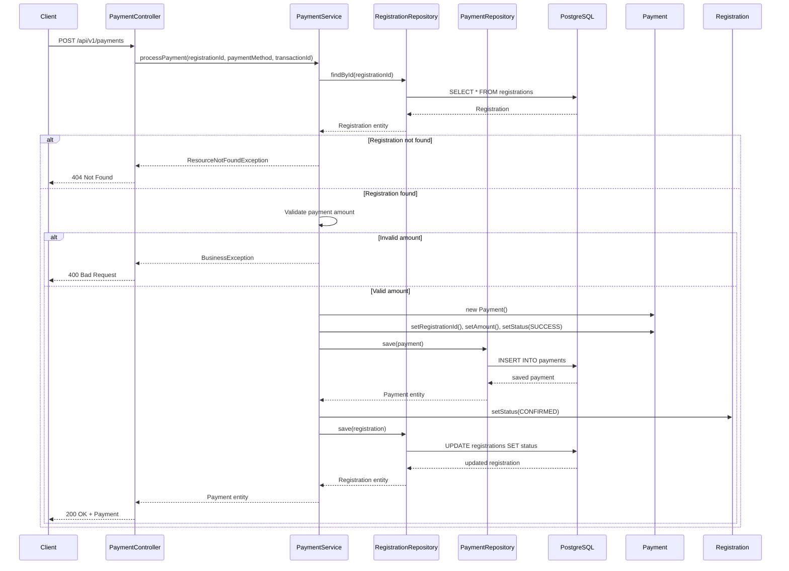
```mermaid
sequenceDiagram
    participant Client
    participant PaymentController
    participant PaymentService
    participant RegistrationRepository
    participant PaymentRepository
    participant PostgreSQL

    Client->>PaymentController: POST /api/v1/payments
    PaymentController->>PaymentService: processPayment(registrationId, paymentMethod, transactionId)
    
    PaymentService->>RegistrationRepository: findById(registrationId)
    RegistrationRepository->>PostgreSQL: SELECT * FROM registrations
    PostgreSQL-->>RegistrationRepository: Registration
    RegistrationRepository-->>PaymentService: Registration entity
    
    alt Registration not found
        PaymentService-->>PaymentController: ResourceNotFoundException
        PaymentController-->>Client: 404 Not Found
    else Registration found
        PaymentService->>PaymentService: Validate payment amount
        
        alt Invalid amount
            PaymentService-->>PaymentController: BusinessException
            PaymentController-->>Client: 400 Bad Request
        else Valid amount
            PaymentService->>Payment: new Payment()
            PaymentService->>Payment: setRegistrationId(), setAmount(), setStatus(SUCCESS)
            
            PaymentService->>PaymentRepository: save(payment)
            PaymentRepository->>PostgreSQL: INSERT INTO payments
            PostgreSQL-->>PaymentRepository: saved payment
            PaymentRepository-->>PaymentService: Payment entity
            
            PaymentService->>Registration: setStatus(CONFIRMED)
            PaymentService->>RegistrationRepository: save(registration)
            RegistrationRepository->>PostgreSQL: UPDATE registrations SET status
            PostgreSQL-->>RegistrationRepository: updated registration
            RegistrationRepository-->>PaymentService: Registration entity
            
            PaymentService-->>PaymentController: Payment entity
            PaymentController-->>Client: 200 OK + Payment
        end
    end
```

---

## 7. Payment Refund Flow

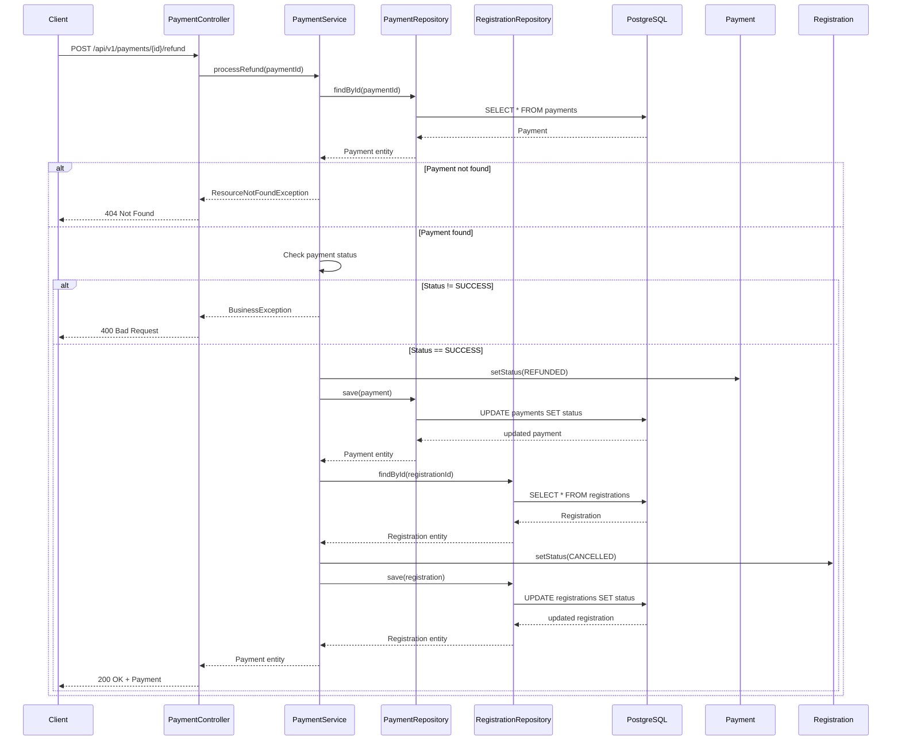
```mermaid
sequenceDiagram
    participant Client
    participant PaymentController
    participant PaymentService
    participant PaymentRepository
    participant RegistrationRepository
    participant PostgreSQL

    Client->>PaymentController: POST /api/v1/payments/{id}/refund
    PaymentController->>PaymentService: processRefund(paymentId)
    
    PaymentService->>PaymentRepository: findById(paymentId)
    PaymentRepository->>PostgreSQL: SELECT * FROM payments
    PostgreSQL-->>PaymentRepository: Payment
    PaymentRepository-->>PaymentService: Payment entity
    
    alt Payment not found
        PaymentService-->>PaymentController: ResourceNotFoundException
        PaymentController-->>Client: 404 Not Found
    else Payment found
        PaymentService->>PaymentService: Check payment status
        
        alt Status != SUCCESS
            PaymentService-->>PaymentController: BusinessException
            PaymentController-->>Client: 400 Bad Request
        else Status == SUCCESS
            PaymentService->>Payment: setStatus(REFUNDED)
            PaymentService->>PaymentRepository: save(payment)
            PaymentRepository->>PostgreSQL: UPDATE payments SET status
            PostgreSQL-->>PaymentRepository: updated payment
            PaymentRepository-->>PaymentService: Payment entity
            
            PaymentService->>RegistrationRepository: findById(registrationId)
            RegistrationRepository->>PostgreSQL: SELECT * FROM registrations
            PostgreSQL-->>RegistrationRepository: Registration
            RegistrationRepository-->>PaymentService: Registration entity
            
            PaymentService->>Registration: setStatus(CANCELLED)
            PaymentService->>RegistrationRepository: save(registration)
            RegistrationRepository->>PostgreSQL: UPDATE registrations SET status
            PostgreSQL-->>RegistrationRepository: updated registration
            RegistrationRepository-->>PaymentService: Registration entity
            
            PaymentService-->>PaymentController: Payment entity
            PaymentController-->>Client: 200 OK + Payment
        end
    end
```

---

## 8. QR Code Generation Flow

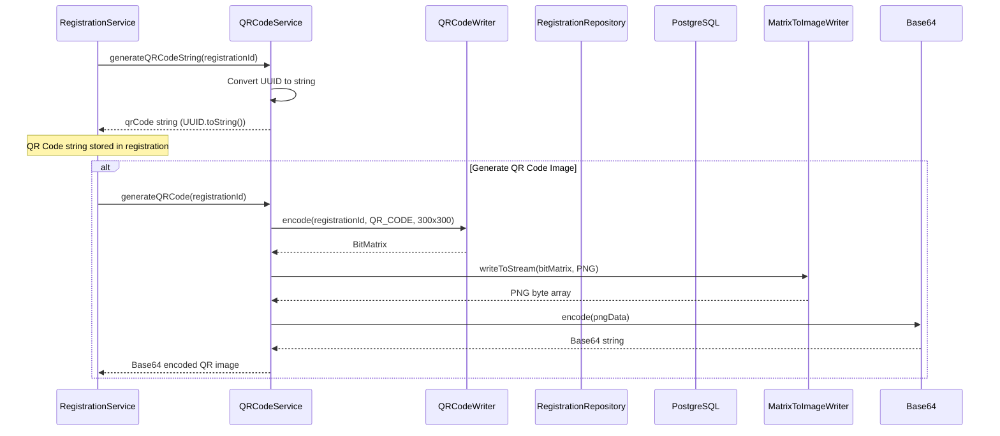
```mermaid
sequenceDiagram
    participant RegistrationService
    participant QRCodeService
    participant QRCodeWriter
    participant RegistrationRepository
    participant PostgreSQL

    RegistrationService->>QRCodeService: generateQRCodeString(registrationId)
    
    QRCodeService->>QRCodeService: Convert UUID to string
    QRCodeService-->>RegistrationService: qrCode string (UUID.toString())
    
    Note over RegistrationService: QR Code string stored in registration
    
    alt Generate QR Code Image
        RegistrationService->>QRCodeService: generateQRCode(registrationId)
        QRCodeService->>QRCodeWriter: encode(registrationId, QR_CODE, 300x300)
        QRCodeWriter-->>QRCodeService: BitMatrix
        
        QRCodeService->>MatrixToImageWriter: writeToStream(bitMatrix, PNG)
        MatrixToImageWriter-->>QRCodeService: PNG byte array
        
        QRCodeService->>Base64: encode(pngData)
        Base64-->>QRCodeService: Base64 string
        
        QRCodeService-->>RegistrationService: Base64 encoded QR image
    end
```

---

## 9. QR Code Retrieval Flow

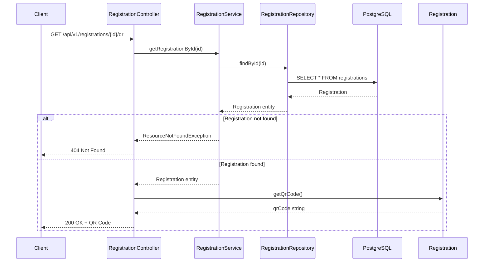
```mermaid
sequenceDiagram
    participant Client
    participant RegistrationController
    participant RegistrationService
    participant RegistrationRepository
    participant PostgreSQL

    Client->>RegistrationController: GET /api/v1/registrations/{id}/qr
    RegistrationController->>RegistrationService: getRegistrationById(id)
    
    RegistrationService->>RegistrationRepository: findById(id)
    RegistrationRepository->>PostgreSQL: SELECT * FROM registrations
    PostgreSQL-->>RegistrationRepository: Registration
    RegistrationRepository-->>RegistrationService: Registration entity
    
    alt Registration not found
        RegistrationService-->>RegistrationController: ResourceNotFoundException
        RegistrationController-->>Client: 404 Not Found
    else Registration found
        RegistrationService-->>RegistrationController: Registration entity
        RegistrationController->>Registration: getQrCode()
        Registration-->>RegistrationController: qrCode string
        RegistrationController-->>Client: 200 OK + QR Code
    end
```

---

## 10. Notification Flow (Async)

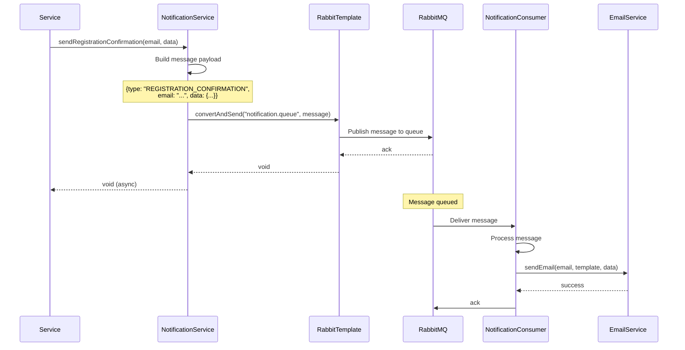
```mermaid
sequenceDiagram
    participant Service
    participant NotificationService
    participant RabbitTemplate
    participant RabbitMQ
    participant NotificationConsumer
    participant EmailService

    Service->>NotificationService: sendRegistrationConfirmation(email, data)
    
    NotificationService->>NotificationService: Build message payload
    Note over NotificationService: {type: "REGISTRATION_CONFIRMATION",<br/>email: "...", data: {...}}
    
    NotificationService->>RabbitTemplate: convertAndSend("notification.queue", message)
    RabbitTemplate->>RabbitMQ: Publish message to queue
    RabbitMQ-->>RabbitTemplate: ack
    RabbitTemplate-->>NotificationService: void
    NotificationService-->>Service: void (async)
    
    Note over RabbitMQ: Message queued
    
    RabbitMQ->>NotificationConsumer: Deliver message
    NotificationConsumer->>NotificationConsumer: Process message
    NotificationConsumer->>EmailService: sendEmail(email, template, data)
    EmailService-->>NotificationConsumer: success
    NotificationConsumer->>RabbitMQ: ack
```

---

## 11. Complete Event Registration & Payment Flow (End-to-End)

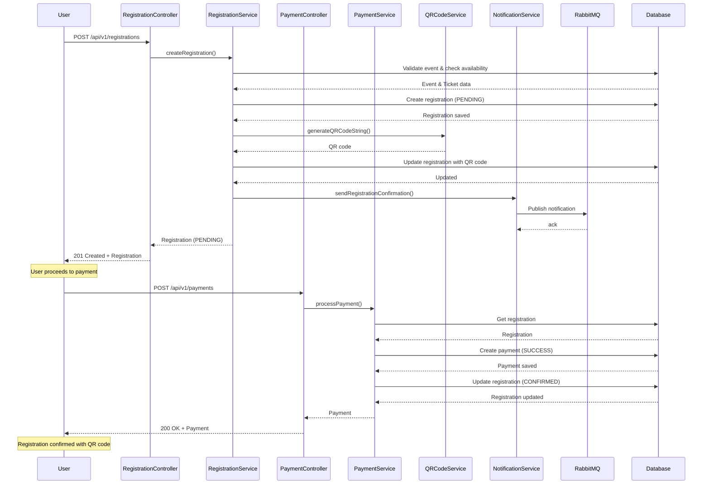
```mermaid
sequenceDiagram
    participant User
    participant RegistrationController
    participant RegistrationService
    participant PaymentController
    participant PaymentService
    participant QRCodeService
    participant NotificationService
    participant RabbitMQ
    participant Database

    User->>RegistrationController: POST /api/v1/registrations
    RegistrationController->>RegistrationService: createRegistration()
    
    RegistrationService->>Database: Validate event & check availability
    Database-->>RegistrationService: Event & Ticket data
    
    RegistrationService->>Database: Create registration (PENDING)
    Database-->>RegistrationService: Registration saved
    
    RegistrationService->>QRCodeService: generateQRCodeString()
    QRCodeService-->>RegistrationService: QR code
    
    RegistrationService->>Database: Update registration with QR code
    Database-->>RegistrationService: Updated
    
    RegistrationService->>NotificationService: sendRegistrationConfirmation()
    NotificationService->>RabbitMQ: Publish notification
    RabbitMQ-->>NotificationService: ack
    
    RegistrationService-->>RegistrationController: Registration (PENDING)
    RegistrationController-->>User: 201 Created + Registration
    
    Note over User: User proceeds to payment
    
    User->>PaymentController: POST /api/v1/payments
    PaymentController->>PaymentService: processPayment()
    
    PaymentService->>Database: Get registration
    Database-->>PaymentService: Registration
    
    PaymentService->>Database: Create payment (SUCCESS)
    Database-->>PaymentService: Payment saved
    
    PaymentService->>Database: Update registration (CONFIRMED)
    Database-->>PaymentService: Registration updated
    
    PaymentService-->>PaymentController: Payment
    PaymentController-->>User: 200 OK + Payment
    
    Note over User: Registration confirmed with QR code
```

---

## 12. Ticket Creation Flow

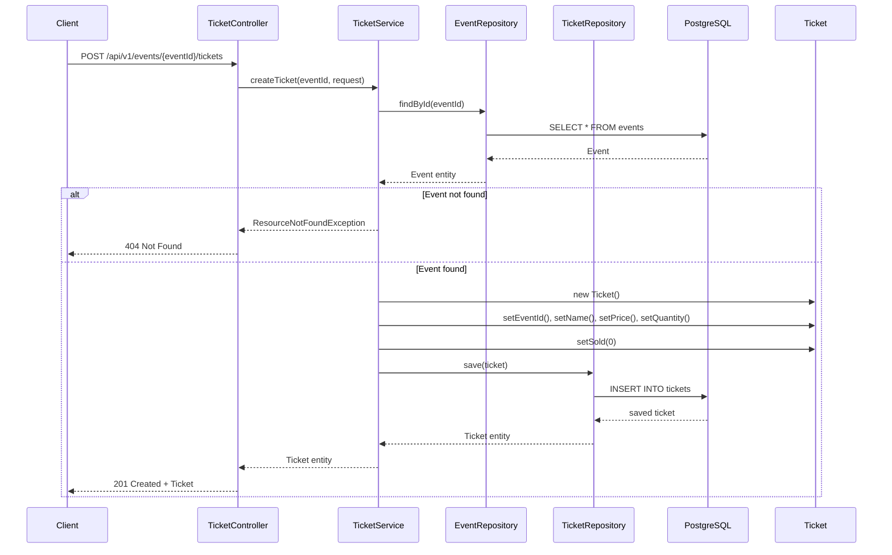
```mermaid
sequenceDiagram
    participant Client
    participant TicketController
    participant TicketService
    participant EventRepository
    participant TicketRepository
    participant PostgreSQL

    Client->>TicketController: POST /api/v1/events/{eventId}/tickets
    TicketController->>TicketService: createTicket(eventId, request)
    
    TicketService->>EventRepository: findById(eventId)
    EventRepository->>PostgreSQL: SELECT * FROM events
    PostgreSQL-->>EventRepository: Event
    EventRepository-->>TicketService: Event entity
    
    alt Event not found
        TicketService-->>TicketController: ResourceNotFoundException
        TicketController-->>Client: 404 Not Found
    else Event found
        TicketService->>Ticket: new Ticket()
        TicketService->>Ticket: setEventId(), setName(), setPrice(), setQuantity()
        TicketService->>Ticket: setSold(0)
        
        TicketService->>TicketRepository: save(ticket)
        TicketRepository->>PostgreSQL: INSERT INTO tickets
        PostgreSQL-->>TicketRepository: saved ticket
        TicketRepository-->>TicketService: Ticket entity
        
        TicketService-->>TicketController: Ticket entity
        TicketController-->>Client: 201 Created + Ticket
    end
```

---

## 13. Event Search Flow

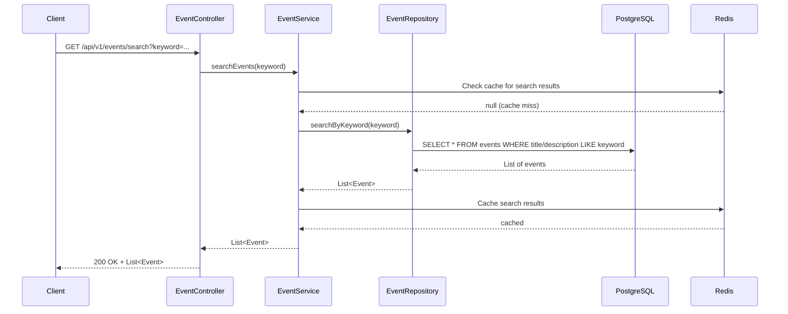
```mermaid
sequenceDiagram
    participant Client
    participant EventController
    participant EventService
    participant EventRepository
    participant PostgreSQL
    participant Redis

    Client->>EventController: GET /api/v1/events/search?keyword=...
    EventController->>EventService: searchEvents(keyword)
    
    EventService->>Redis: Check cache for search results
    Redis-->>EventService: null (cache miss)
    
    EventService->>EventRepository: searchByKeyword(keyword)
    EventRepository->>PostgreSQL: SELECT * FROM events WHERE title/description LIKE keyword
    PostgreSQL-->>EventRepository: List of events
    EventRepository-->>EventService: List<Event>
    
    EventService->>Redis: Cache search results
    Redis-->>EventService: cached
    
    EventService-->>EventController: List<Event>
    EventController-->>Client: 200 OK + List<Event>
```

---

## 14. Registration Cancellation Flow

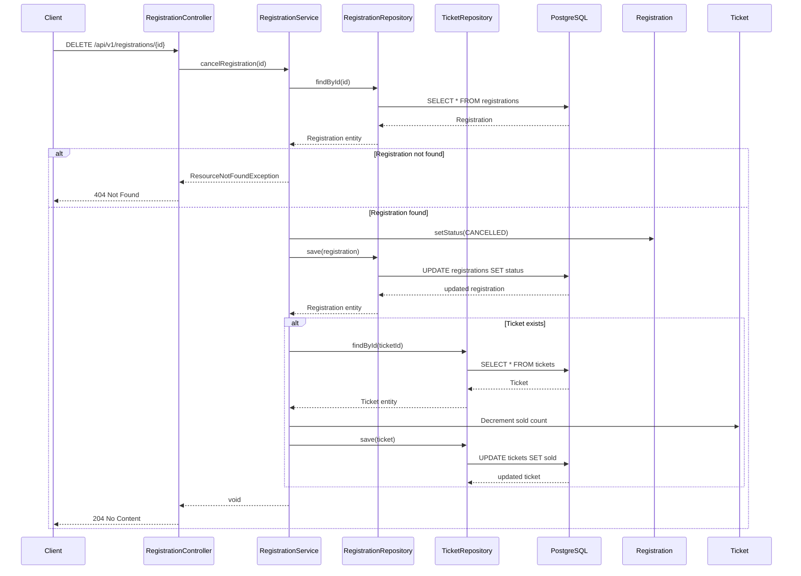
```mermaid
sequenceDiagram
    participant Client
    participant RegistrationController
    participant RegistrationService
    participant RegistrationRepository
    participant TicketRepository
    participant PostgreSQL

    Client->>RegistrationController: DELETE /api/v1/registrations/{id}
    RegistrationController->>RegistrationService: cancelRegistration(id)
    
    RegistrationService->>RegistrationRepository: findById(id)
    RegistrationRepository->>PostgreSQL: SELECT * FROM registrations
    PostgreSQL-->>RegistrationRepository: Registration
    RegistrationRepository-->>RegistrationService: Registration entity
    
    alt Registration not found
        RegistrationService-->>RegistrationController: ResourceNotFoundException
        RegistrationController-->>Client: 404 Not Found
    else Registration found
        RegistrationService->>Registration: setStatus(CANCELLED)
        RegistrationService->>RegistrationRepository: save(registration)
        RegistrationRepository->>PostgreSQL: UPDATE registrations SET status
        PostgreSQL-->>RegistrationRepository: updated registration
        RegistrationRepository-->>RegistrationService: Registration entity
        
        alt Ticket exists
            RegistrationService->>TicketRepository: findById(ticketId)
            TicketRepository->>PostgreSQL: SELECT * FROM tickets
            PostgreSQL-->>TicketRepository: Ticket
            TicketRepository-->>RegistrationService: Ticket entity
            
            RegistrationService->>Ticket: Decrement sold count
            RegistrationService->>TicketRepository: save(ticket)
            TicketRepository->>PostgreSQL: UPDATE tickets SET sold
            PostgreSQL-->>TicketRepository: updated ticket
        end
        
        RegistrationService-->>RegistrationController: void
        RegistrationController-->>Client: 204 No Content
    end
```

---

## 15. Venue Creation Flow

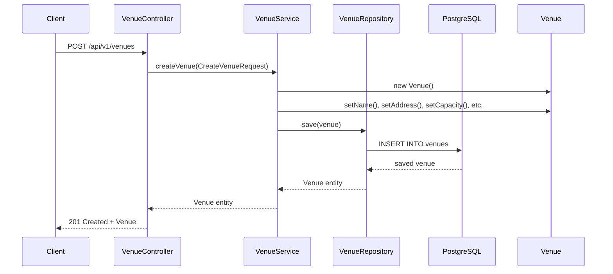
```mermaid
sequenceDiagram
    participant Client
    participant VenueController
    participant VenueService
    participant VenueRepository
    participant PostgreSQL

    Client->>VenueController: POST /api/v1/venues
    VenueController->>VenueService: createVenue(CreateVenueRequest)
    
    VenueService->>Venue: new Venue()
    VenueService->>Venue: setName(), setAddress(), setCapacity(), etc.
    
    VenueService->>VenueRepository: save(venue)
    VenueRepository->>PostgreSQL: INSERT INTO venues
    PostgreSQL-->>VenueRepository: saved venue
    VenueRepository-->>VenueService: Venue entity
    
    VenueService-->>VenueController: Venue entity
    VenueController-->>Client: 201 Created + Venue
```

---

## Notes

- All sequence diagrams use **Mermaid** syntax and can be rendered in:
  - GitHub/GitLab markdown viewers
  - Documentation tools (MkDocs, Docusaurus, etc.)
  - Online Mermaid editors (mermaid.live)
  - VS Code with Mermaid extensions

- **Database operations** are shown as direct PostgreSQL interactions, but in reality they go through:
  - JPA/Hibernate ORM layer
  - Connection pooling (HikariCP)
  - Transaction management

- **Error handling** is simplified in diagrams but follows the exception hierarchy:
  - `ResourceNotFoundException` → 404 Not Found
  - `BusinessException` → 400 Bad Request
  - `GlobalExceptionHandler` processes all exceptions

- **Async operations** (RabbitMQ) are fire-and-forget from the service perspective, but consumers handle the actual notification delivery.

